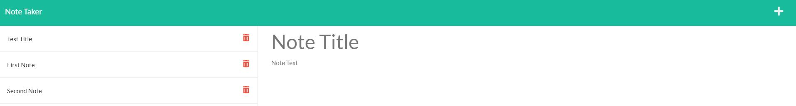

# Note-Taker

## Description

This project consists of creating an app called Note Taker that will be used to write and save notes.

This application is deployed using Heroku. Express and UIDD npm packages were used.

## Technologies

* JavaScript
* Node.js
* Express Package
* UUID Package

## Mock Up

To see the page deployed in your browser click on the link: https://protected-atoll-58416.herokuapp.com/